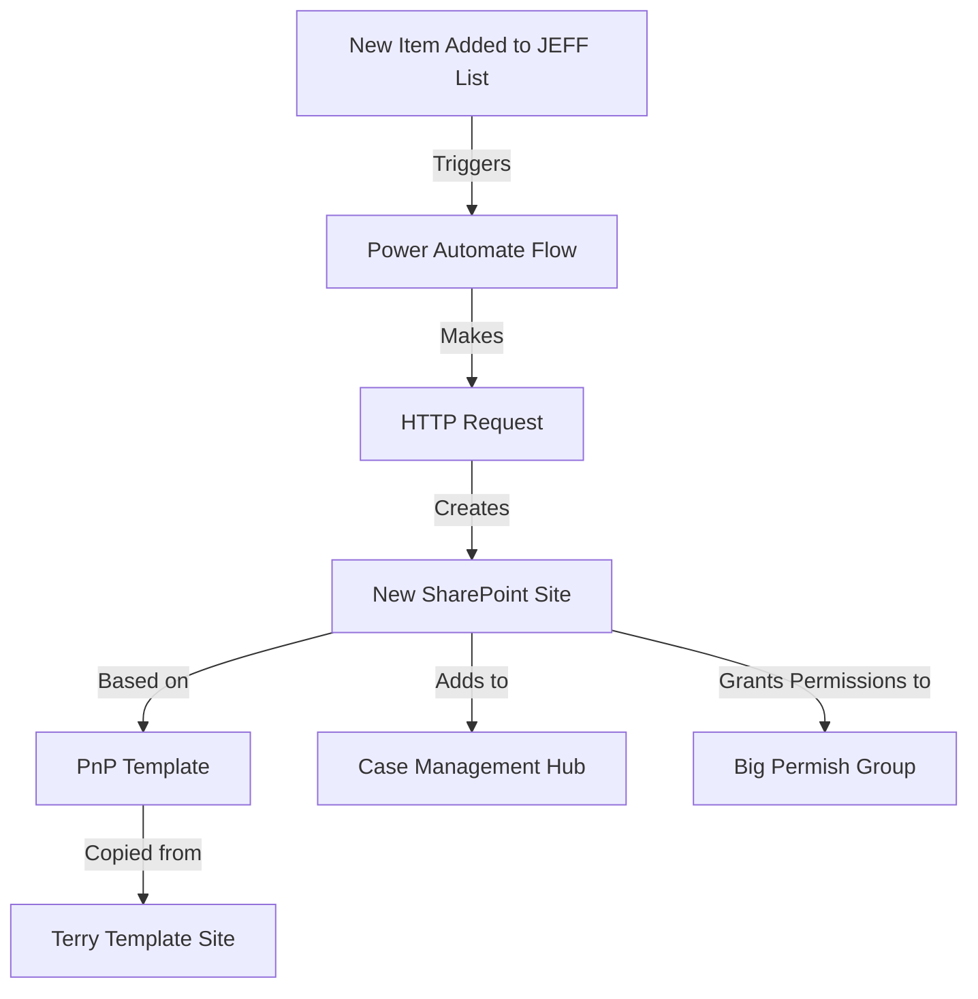
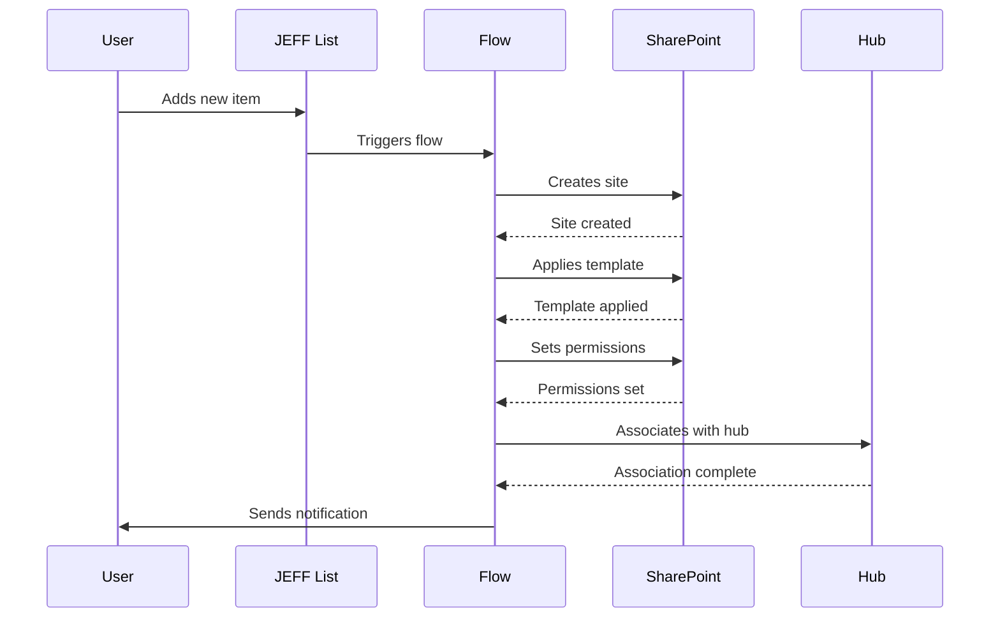

# Automated Site Creation with Power Automate and PnP Template

Imagine you're building an automated system that creates new SharePoint sites whenever someone adds an item to a list - like a magical factory that produces fully-formed websites! That's exactly what we're going to build together. Let's break this down into manageable pieces and walk through each step.

## Overview of What We're Building

Before we dive in, let's understand what our automation will do:



## Part 1: Creating the PnP Template from Terry Template

First, we need to capture the essence of the Terry Template site into a PnP template. Think of this like taking a photograph of a room so you can recreate it exactly somewhere else.

### Step 1: Connect to Terry Template Site

```powershell
# Install PnP PowerShell if you haven't already
Install-Module -Name "PnP.PowerShell" -Force -AllowClobber

# Connect to the Terry Template site
Connect-PnPOnline -Url "https://mordinilaw.sharepoint.com/teams/TerryTemplate" -Interactive

# Create the template
$templatePath = "C:\Templates\TerryTemplate.xml"
Get-PnPSiteTemplate `
    -Out $templatePath `
    -Handler Lists,Fields,ContentTypes,Pages,Navigation,Files,CustomActions `
    -IncludeAllPages `
    -PersistBrandingFiles `
    -Force
```

### Step 2: Review and Clean Template
Open the template file and ensure it contains all necessary components. You might see something like this:

```xml
<?xml version="1.0"?>
<pnp:Provisioning xmlns:pnp="http://schemas.dev.office.com/PnP/2021/03/ProvisioningSchema">
  <pnp:Preferences>
    <pnp:Parameters>
      <!-- Template parameters will be here -->
    </pnp:Parameters>
  </pnp:Preferences>
  <!-- Rest of your template configuration -->
</pnp:Provisioning>
```

## Part 2: Setting Up the Power Automate Flow

Now let's create the flow that will orchestrate our site creation. Think of this as setting up a series of dominoes that will fall in perfect sequence.

### Step 1: Create New Flow

1. Go to make.powerautomate.com
2. Click "Create" → "Automated cloud flow"
3. Name your flow: "Create Site from JEFF List"
4. Choose trigger: "When an item is created in SharePoint"

### Step 2: Configure Trigger

Configure the trigger with these settings:
```
Site Address: [Your SharePoint site with JEFF list]
List Name: JEFF
```

### Step 3: Add HTTP Request Action

This is where the magic happens. We'll use the SharePoint REST API to create our site:

```json
{
    "Body": {
        "request": {
            "__metadata": {
                "type": "Microsoft.SharePoint.Portal.SPSiteCreationRequest"
            },
            "Title": "@{triggerBody()?['Title']}",
            "Url": "https://mordinilaw.sharepoint.com/sites/@{triggerBody()?['SiteUrl']}",
            "WebTemplate": "STS#3",
            "Owner": "@{triggerBody()?['Author']?['Email']}",
            "HubSiteId": "[Case Management Hub ID]",
            "Description": "Site created from JEFF list"
        }
    },
    "Uri": "https://mordinilaw.sharepoint.com/_api/SPSiteManager/Create",
    "Headers": {
        "Accept": "application/json;odata=verbose",
        "Content-Type": "application/json;odata=verbose",
        "Authorization": "Bearer @{outputs('Get_SharePoint_access_token')?['access_token']}"
    },
    "Method": "POST"
}
```

### Step 4: Add Delay Action

We need to give SharePoint a moment to create the site. Add a "Delay" action:
```
Duration: 2 minutes
```

### Step 5: Apply PnP Template

Add another HTTP request to apply our template:

```json
{
    "Uri": "https://mordinilaw.sharepoint.com/sites/@{triggerBody()?['SiteUrl']}/_api/web/ApplyPnPTemplate",
    "Method": "POST",
    "Headers": {
        "Accept": "application/json;odata=verbose",
        "Content-Type": "application/json;odata=verbose"
    },
    "Body": {
        "templatePath": "[Your template path]"
    }
}
```

### Step 6: Set Permissions

Add an action to grant permissions to the "Big Permish" group:

```json
{
    "Uri": "https://mordinilaw.sharepoint.com/sites/@{triggerBody()?['SiteUrl']}/_api/web/roleassignments/addroleassignment(principalid=@{variables('BigPermishGroupId')},roledefid=1073741829)",
    "Method": "POST",
    "Headers": {
        "Accept": "application/json;odata=verbose",
        "Content-Type": "application/json;odata=verbose"
    }
}
```

## Part 3: Testing and Troubleshooting

Let's set up a proper testing process:

1. Create a test item in the JEFF list with these values:
   ```
   Title: Test Site Creation
   SiteUrl: test-site-creation-001
   ```

2. Monitor the flow execution in real time:
   - Open the flow
   - Click "Run History"
   - Watch each step execute

3. Common Issues and Solutions:

| Issue | Solution |
|-------|----------|
| "Access denied" | Check flow connections and permissions |
| Template not applying | Verify template path and format |
| Site creation fails | Check URL format and availability |
| Permissions not set | Verify group ID and role definition |

## Part 4: JEFF List Configuration

Your JEFF list should have these columns:

```
Title (Single line of text) - Required
SiteUrl (Single line of text) - Required
    - Description: "Will be used in site URL - no spaces or special characters"
    - Validation formula: =AND(LEN([SiteUrl])>0,ISERROR(FIND(" ",[SiteUrl])))
RequestedBy (Person or Group) - Required
    - Default value: [Me]
```

## Best Practices and Tips

1. Site Naming Convention:
   - Use lowercase letters
   - Avoid spaces and special characters
   - Example: "case-smith-2024" instead of "Case Smith 2024"

2. Error Handling:
   - Add condition checks before each major step
   - Include email notifications for failures
   - Log all operations

3. Maintenance:
   - Review flow runs weekly
   - Update template monthly
   - Document all customizations

4. Security:
   - Regular permission audits
   - Review site creation logs
   - Monitor usage patterns

## Visual Guide to Site Creation Process



## What to Do When Things Go Wrong

If your site creation process encounters issues, follow these steps:

1. Check Flow History:
   - Look for red X marks
   - Read error messages carefully
   - Note which step failed

2. Verify Permissions:
   - Flow connection permissions
   - User permissions
   - Site collection admin rights

3. Template Issues:
   - Check template file accessibility
   - Verify template format
   - Look for missing components

4. Still stuck? Here's your checklist:
   - Screenshot the error
   - Note the time of failure
   - Document the steps taken
   - Contact support with details

Remember: Every error is an opportunity to make your automation more robust!
